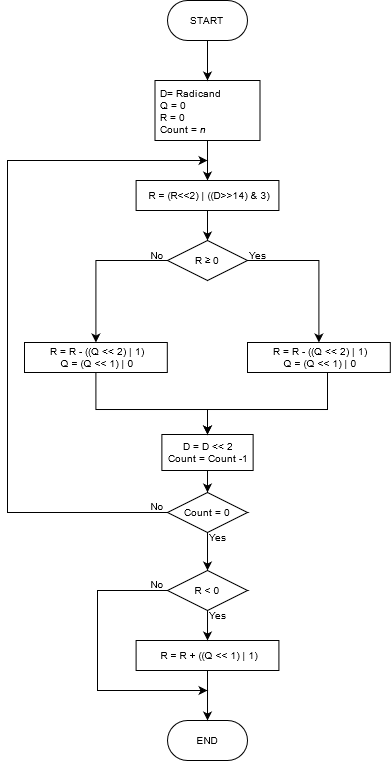

# System Verilog MDR module
- [Introduction](#introduction)
- [Detailed I/O](#detailed-io)
- [Algorithms used](#algorithms-used)

## Introduction
Project that contains an arithmetic module that is able to calculates the multiplication, division or square root of signed integers up to 10 bits. Coded in System Verilog.

The module has the following interface:

To see the microarchitecture diagram, please refer to the [readme resource](https://github.com/GustavoRuedaEnriquez/mdr-sv/blob/master/readme_resources/microarchitecture-diagram.svg).

The module works on simulation using [ModelSim](https://www.intel.com/content/www/us/en/software/programmable/quartus-prime/model-sim.html) and on a physical [FPGA DE2-115 board](https://fpgacloud.intel.com/devstore/board/altera-de2-115-development-and-education-board/).

## Detailed I/O
Each of the I/O ports has a purpose, the table below contains all the detailed description of all the I/O ports of the module:

| Name      | Category | Description                                                                                                                                                                                  |
|-----------|----------|----------------------------------------------------------------------------------------------------------------------------------------------------------------------------------------------|
| data      | input    | Desired number to enter, its format is signed integer. Maximum length n of 10 bits.                                                                                                          |
| start     | input    | Signal the starts the whole process.                                                                                                                                                         |
| load      | input    | Signal that indicates a number (data) must be registered.                                                                                                                                    |
| op        | input    | Indicates the desired arithmetic operation to execute. M = 0, D = 1 and R = 2.                                                                                                               |
| clk       | input    | Clock signal.                                                                                                                                                                                |
| reset     | input    | Reset signal.                                                                                                                                                                                |
| result    | output   | Result of the operation (Product, quotient or root), with length of n bits. If there is an overflow, the result will be -1.                                                                  |
| remainder | output   | Remainder of the operation (only applicable for division and square root).                                                                                                                   |
| load x    | output   | Signal that indicates the module is ready for the data x to be entered. The data y on the multiplication represents the multiplicand, on division is the divisor and on square root is the radicand. |
| load y    | output   | Signal that indicates the module is ready for the data y to be entered. The data y on the multiplication represents the multiplier and on division is the dividend (if the operation is square root, this signal is never activated). |
| error     | output   | Error signal (division by 0, square root of a negative number).                                                                                                                              |
| ready     | output   | Signal that indicates the module ir ready to perform an operation.                                                                                                                           |
## Algorithms used
### Multiplication algorithm
The Booth's multiplication algorithm was used.

### Division algorithm
The Booth's restoring division algorithm was used.

### Square root algorithm
The following algorithm was used.

